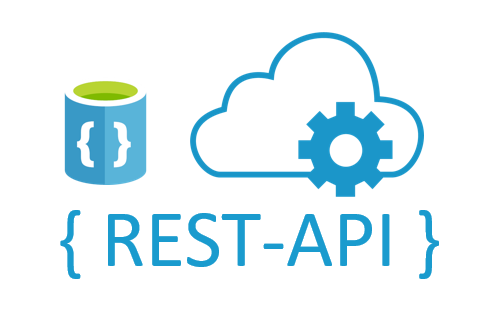

# Using REST API with Microsoft SQL Server

REST API for reading and writing data for [Microsoft SQL Server](https://www.microsoft.com/en-us/sql-server) enables you easy read and write data from your database. With help of [Node.js](https://nodejs.org/en/) you can create a API service, authentication and underlying functions for easier and faster data operations.

<br>
<div>

</div>
<br>


## Feature Summary

  - Reading data from MSSQL using API ([blog post](https://tomaztsql.wordpress.com/2021/08/10/creating-rest-api-for-reading-data-from-microsoft-sql-server-in-web-browser/))
  - Writing data to MSSQL using API  ([blog post]())
  - Creating predictions using API and R ([blog post]())
  - Creating predictions using API and Python ([blog post]())


## Cloning the repository
You can follow the steps below to clone the repository.
```
git clone https://github.com/tomaztk/Useless_R_functions.git
```


## Contributing
Do the usual GitHub fork and pull request dance. Add yourself (or I will add you to the contributors section) if you want to. 


## Suggestions
Feel free to suggest any new topics that you would like to be covered or follow the blog ([Blog post](https://tomaztsql.wordpress.com/))


## License
[MIT](https://choosealicense.com/licenses/mit/) © Tomaž Kaštrun
